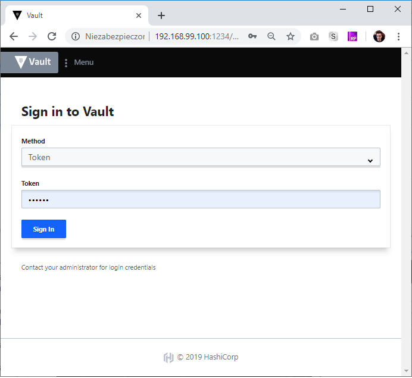

# Vault Demo

Sample application written in dotnet core 2.1 which shows how to connect and read data from vaultproject docker container :)

## Setup

Firstly, run the docker vault container

```shell
./scripts/run-vault.sh
```

Open up the browser to configure secrets in vault.  



Create Key Value (KV) Secret Engine.

Create sample secret  


Next, ensure that configuration in `appsettings.json` matches your docker container deployment (maily the ip address)

Run the dotnet core project.

```shell
dotnet run
```

You should see:

```shell
PS C:\repo\vaultsharp-demo> dotnet run
data from vault.
Login:toumash
Passwordtoumashpassword
```